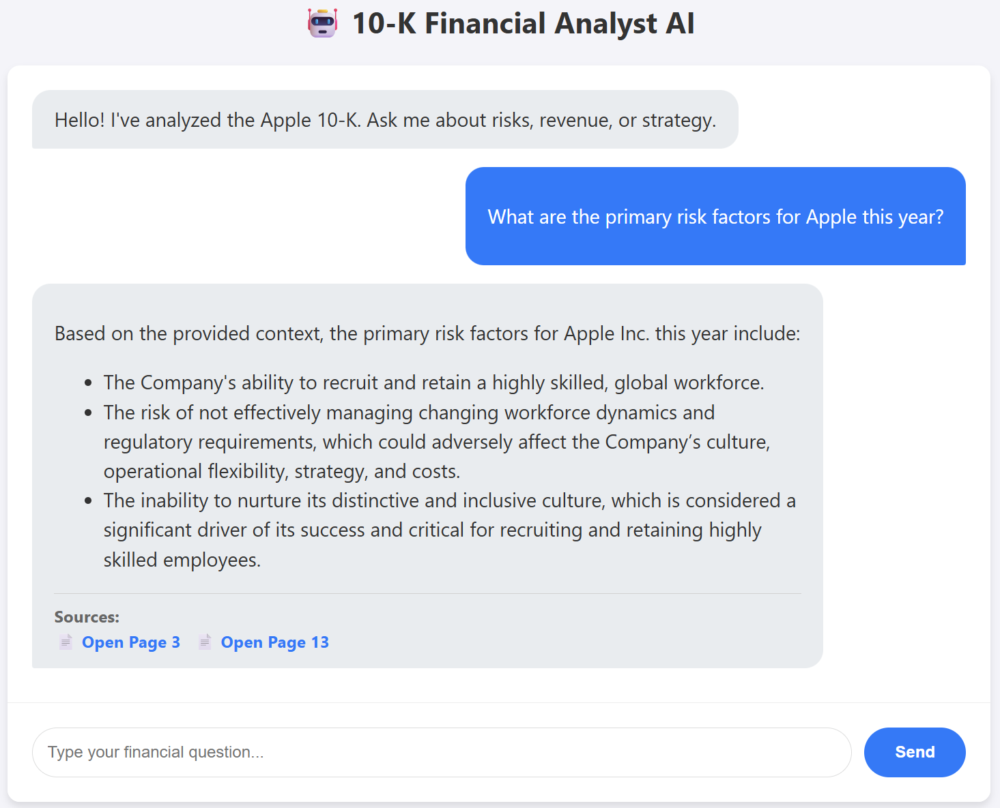

# 💰 Financial Analyst AI (RAG Chatbot)

An intelligent financial assistant that analyzes **10-K Annual Reports** using **Retrieval Augmented Generation (RAG)**. Built with **FastAPI**, **LangChain**, **Google Gemini**, and a vanilla **JavaScript** frontend.

**[🚀 Live Demo](https://financial-analyst-chat.onrender.com)**



## ✨ Key Features
* **RAG Architecture:** Ingests complex PDF financial reports, chunks them, and stores embeddings in **ChromaDB**.
* **Smart Citation:** The AI doesn't just answer; it **cites the exact page number**.
* **PDF Viewer Integration:** Clicking a citation opens the **actual PDF** scrolled to the specific page for verification.
* **Streaming Responses:** Real-time token streaming for a responsive UI experience.
* **Hybrid Tech Stack:** Python (FastAPI/LangChain) for the "brain" and Vanilla JS for a lightweight, fast frontend.

## 🛠️ Tech Stack
* **LLM:** Google Gemini 1.5 Flash
* **Backend:** Python, FastAPI, Uvicorn
* **Orchestration:** LangChain (LCEL Architecture)
* **Vector DB:** ChromaDB
* **Frontend:** HTML5, CSS3, Vanilla JavaScript (Streaming API)
* **Deployment:** Render (Cloud Hosting)

## 🚀 How to Run Locally

### 1. Clone the Repo
```bash
git clone [https://github.com/Amsyar0689/financial-rag-chat.git](https://github.com/Amsyar0689/financial-rag-chat.git)
cd financial-rag-chat
```

2.  **Install Dependencies**
```bash
pip install -r requirements.txt
```

3.  **Setup Environment**  Create a `.env` file in the root directory:  
```bash
GOOGLE_API_KEY=your_google_api_key_here
```

4.  **Ingest Data (Build the Brain)**  The script reads the PDF and builds the Vector Database
```bash
python src/ingest.py
```

4.  **Run the App**
```bash
python src/api.py
```

Open your browser to `http://127.0.0.1:8000`.

### 📂 Project Structure
```text
/
├── src/
│   ├── api.py           # FastAPI Backend & RAG Logic
│   └── ingest.py        # Data Pipeline (PDF -> Vector DB)
├── static/              # Frontend Assets
│   ├── index.html
│   ├── script.js
│   └── style.css
├── chroma_db/           # Local Vector Database (Generated)
└── requirements.txt
```
